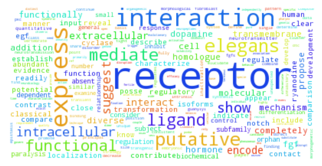

.. index:: Examples; LDA for Multinomial likelihood

.. _example-LDA-MultinomialDirichlet:

LDA for Multinomial likelihood
------------------------------

We have already looked at modeling one group of data points that are drawn from a mixture Multinomial distribution in :ref:`example-BMM-MultinomialDirichlet`. Now we aim to look at the modeling ``J`` groups of data where each group is drawn from a mixture of Multinomial distributions while it is desired for these groups to share their mixture components.

Here we assume:

* the probability vector of the Multinomial distribution is drawn from a Dirichlet distribution

Since usually ``MultinomialDirichlet`` conjugate is used in the context of text processing, we also adopt the same jargon. In this context, each mixing component is called a topic as it is a multinomial distribution over a vocabulary. There is a subtle difference in how a sample is drawn from these sentences in different papers. Some works assume that each word in a sentence is drawn from a different topic and draw one word at a time from a topic. Some other assume each sentence is drawn from one topic, and draw a sentence (i.e. n words) at a time from a topic.

Both methods are implemented in **BIAS** package and the relevant examples are given in the following sections.

Problem
^^^^^^^

We have :math:`J` groups of data points. Each group is generated by a mixture of :math:`K` topics. Assuming ``J`` groups share the topics, infer them from the data.

Model
^^^^^
.. math::

    \boldsymbol{\pi}|\alpha      &\sim   \text{Dirichlet}\left(\alpha\right)\\
    \phi_{k}|\beta               &\sim   \text{Dirichlet}\left(\beta\right)\\
    z_{ji}|\boldsymbol{\pi}_{j}  &\sim   \boldsymbol{\pi}_{j}\\
    x_{ji}|z_{ji},\phi_{1:K}     &\sim   \phi_{z_{ji}}

Simulated data
^^^^^^^^^^^^^^

First we need to specify the parameters of some "true" topics. Below, we create 10 topics over 25 words.

.. code-block:: julia

    using BIAS
    srand(123)

    true_KK = 10
    vocab_size = 25

    true_topics = BIAS.gen_bars(true_KK, vocab_size, 0)
    visualize_bartopics(true_topics)

.. _figure-true_topics:

    true topics

Scenario 1: MultinomialDirichelt with single observations
"""""""""""""""""""""""""""""""""""""""""""""""""""""""""
Now we are ready to simulate the corpus. In this section, we assume the observations are single words. We construct a corpus of 100 documents (groups), each document consisting of 50 words (observations).

.. code-block:: julia

    n_groups = 100
    n_group_j = 50 * ones(Int, n_groups)
    max_n_topic_doc = 4
    n_groups = 100

    xx = Array(Vector{Int}, n_groups)
    true_zz = Array(Vector{Int}, n_groups)
    true_nn = zeros(Int, n_groups, true_KK)
    n_topic_doc_p = cumsum(fill(1/max_n_topic_doc, max_n_topic_doc))

    for jj = 1:n_groups
      n_topic_doc = sum(rand() .< n_topic_doc_p)
      topic_doc = randperm(true_KK)[1:n_topic_doc]

      xx[jj] = zeros(Int, n_group_j[jj])
      true_zz[jj] = ones(Int, n_group_j[jj])
      for ii = 1:n_group_j[jj]
        kk = topic_doc[rand(1:n_topic_doc)]
        true_zz[jj][ii] = kk
        xx[jj][ii] = BIAS.sample(true_topics[kk, :][:])
        true_nn[jj, kk] += 1
      end
    end

Model construction
""""""""""""""""""
The prior-likelihood pair of this model can be seen as a ``MultinomialDirichlet`` component.

.. code-block:: julia

    dd = vocab_size
    aa = 0.1 * dd
    q0 = MultinomialDirichlet(dd, aa)

Now we construct and instantiate the model:

.. code-block:: julia

    lda_KK = true_KK
    lda_aa = 0.1
    lda = LDA(q0, lda_KK, lda_aa)

    zz = Array(Vector{Int}, n_groups)
    for jj = 1:n_groups
        zz[jj] = ones(Int, n_group_j[jj])
    end
    init_zz!(lda, zz)

Inference
"""""""""
Now it is time to run the inference routine:

.. code-block:: julia

    n_burnins   = 100
    n_lags      = 2
    n_samples   = 400
    store_every = 100
    filename    = "demo_LDA_Multinomial_Dirichlet"

    collapsed_gibbs_sampler!(lda, xx, zz, n_burnins, n_lags, n_samples, store_every, filename)

    # posterior distributions
    posterior_components, nn = posterior(lda, xx, zz)

to obtain the posterior distributions:

.. code-block:: julia

    inferred_topics = zeros(Float64, length(posterior_components), vocab_size)
    for kk = 1:length(posterior_components)
        inferred_topics[kk, :] = mean(posterior_components[kk])
    end

    visualize_bartopics(inferred_topics)

.. _figure-inferred_topics1:

    inferred topics

As it is readily seen from two figures, the model has successfully inferred the topics. Also:

Scenario 2: MultinomialDirichelt with multiple observations
"""""""""""""""""""""""""""""""""""""""""""""""""""""""""""
In this section we assume instead of drawing one word at a time form a topic, we draw a sentence i.e. n words. We construct a corpus of 25 documents (groups), each document consisting of 100 sentences, and each sentence consisting of 230 words.

.. code-block:: julia

    n_groups = 25
    n_group_j = 100 * ones(Int, n_groups)
    n_tokens = 20

    alpha = 0.1
    xx = Array(Vector{Sent}, n_groups)
    true_zz = Array(Vector{Int}, n_groups)
    true_nn = zeros(Int, n_groups, true_KK)
    for jj = 1:n_groups
        xx[jj] = Array(Sent, n_group_j[jj])
        true_zz[jj] = ones(Int, n_group_j[jj])
        theta = BIAS.rand_Dirichlet(fill(alpha, true_KK))
        for ii = 1:n_group_j[jj]
            kk = sample(theta)
        sentence = sample(true_topics[kk, :][:], n_tokens)
        xx[jj][ii] = BIAS.sparsify_sentence(sentence)
        true_zz[jj][ii] = kk
        true_nn[jj, kk] += 1
      end
    end

Model construction
""""""""""""""""""
Similar to scenario 1, we construct the conjugate object.

.. code-block:: julia

    dd = vocab_size
    aa = 0.1 * dd
    q0 = MultinomialDirichlet(dd, aa)

Now we construct and instantiate the model:

.. code-block:: julia

    lda_KK = true_KK
    lda_aa = 0.1
    lda = LDA(q0, lda_KK, lda_aa)

    zz = Array(Vector{Int}, n_groups)
    for jj = 1:n_groups
        zz[jj] = ones(Int, n_group_j[jj])
    end
    init_zz!(lda, zz)

Inference
"""""""""
Now it is time to run the inference routine:

.. code-block:: julia

    n_burnins   = 100
    n_lags      = 2
    n_samples   = 100
    store_every = 100
    filename    = "demo_LDA_Multinomial_Dirichlet"

    collapsed_gibbs_sampler!(lda, xx, zz, n_burnins, n_lags, n_samples, store_every, filename)

    # posterior distributions
    posterior_components, nn = posterior(lda, xx, zz)

to obtain the posterior distributions:

.. code-block:: julia

    inferred_topics = zeros(Float64, length(posterior_components), vocab_size)
    for kk = 1:length(posterior_components)
        inferred_topics[kk, :] = mean(posterior_components[kk])
    end

    visualize_bartopics(inferred_topics)

.. _figure-inferred_topics_sparse:

    inferred topics

As it is readily seen from two figures, the model has successfully inferred the topics. Also:

Real data
^^^^^^^^^
In this section we fit LDA to a corpus of nematode biology abstracts (see https://web.archive.org/web/20040328153507/http://elegans.swmed.edu/wli/cgcbib). Yee Why Teh has used this dataset to validate HDP and showed that a model with 50 to 80 topics has the least perplexity :cite:`teh2006hierarchical`. We choose to fit a model with 70 topics on this dataset. The provided data, it taken from the link above and preprocessed. It consists of 5957 abstracts and the vocabulary size is 3793. Please consider that we are using the first representation of a MultinomialDirichelt object for this example.

First we read the dataset.

.. code-block:: julia

    f = open("datasets\\cgcbib\\cgcbib_abs_bow.txt")
    lines = readlines(f)
    close(f)

    n_lines = length(lines)
    n_groups = 5957
    n_group_j = zeros(Int, n_groups)
    n_vocab = 3793

    lines_mat = zeros(Int, n_lines, 4)
    for i = 1:n_lines
      line = split(strip(lines[i]))
      line = [parse(Int, s) for s = line]
      lines_mat[i, :] = line
    end

    xx = Array(Vector{Int}, n_groups)

    for jj = 1:n_groups
      print("$jj ")
      mask = lines_mat[:, 1] .== jj-1
      xx_jj_mat = lines_mat[mask, :]
      xx_jj = Int[]

      for ii=1:size(xx_jj_mat, 1)
        for rr=1:xx_jj_mat[ii, 4]
          push!(xx_jj, xx_jj_mat[ii, 3]+1)
        end
      end
      xx[jj] = xx_jj
    end

    n_group_j = zeros(Int, n_groups)
    for jj = 1:n_groups
      n_group_j[jj] = length(xx[jj])
    end

The rest is similar to previous exampes.

.. code-block:: julia

    dd = n_vocab
    aa = 0.5 * n_vocab
    q0 = MultinomialDirichlet(dd, aa)

    # constructing the model
    lda_KK = 70
    lda_aa = 1.5
    lda = LDA(q0, lda_KK, lda_aa)

    # sampling
    zz = Array(Vector{Int}, n_groups)
    for jj = 1:n_groups
        zz[jj] = ones(Int, n_group_j[jj])
    end

    init_zz!(lda, zz)

    n_burnins   = 200
    n_lags      = 1
    n_samples   = 300
    sample_hyperparam = true
    store_every = 1000
    filename    = "cgc_LDA_results_"
    collapsed_gibbs_sampler!(lda, xx, zz, n_burnins, n_lags, n_samples, store_every, filename)
    posterior_components, nn = posterior(lda, xx, zz)

Looking at the numerical values of a topic with cardinality of 3793 is not very informative. One better way is plotting the wordcloud of the topic. A wordcloud is a graphical representation of the topic where the font size of each word is linearly related to its weight in the probability vector.

The following code will create a directory and saves the topics as csv files and wordclouds in it.

.. code-block:: julia

    f = open("datasets\\cgcbib\\cgcbib_abs_vocab.txt")
    vocab = readlines(f)
    close(f)
    vocab = [strip(vv) for vv in vocab]

    dirname = "datasets\\cgcbib\\LDA_results"
    mkdir(dirname)

    for kk = 1:length(posterior_components)

        filename = join([dirname, "topic$(kk).csv"], "/")
        topic2csv(filename, vocab, posterior_components[kk].alpha)

        filename = join([dirname, "topic$(kk).png"], "/")
        topic2png(filename, vocab, posterior_components[kk].alpha)
    end

One of the topics inferred from the data is shown here:

.. _figure-cgc_LDA_topic_example:

    a topic inferred from cgcbib dataset using LDA